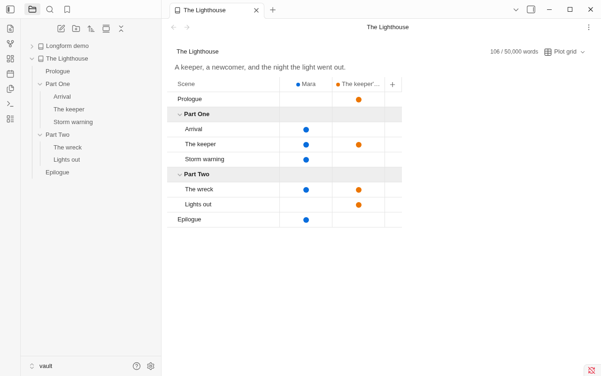

<h1 align="center">Binders</h1>

<p align="center"><b>Ordered folders for long-form writing, inside Obsidian.</b><br>
A binder in the file explorer · a corkboard · a plot grid · the whole manuscript as one editable page</p>

Folders in Obsidian list their notes by name. Books don't work that way. Binders turns a folder into a **binder**: its
chapters and scenes keep the order you give them, in Obsidian's own file explorer. Open a binder to see the same notes
as a corkboard, a plot grid, or one continuous manuscript you can edit.

Everything stays plain Markdown. A binder is a folder plus one note that holds its order, and everything about a scene
is in that scene's own properties. Turn Binders off and your notes are still ordinary notes.


## Getting started

1. Right-click a folder in the file explorer and choose **Make this folder a binder**. Its notes and subfolders keep the
   order they show in now.
2. Click the folder. The binder view opens on it, as a corkboard.
3. Drag cards into the order you want. The file explorer follows.

To add a scene, use **New note** at the end of a group on the corkboard, or **New scene here** in the folder's
right-click menu or the command palette.

## The binder view

One view, three ways of seeing the notes in a binder or in one of its folders. Switch with the button at the top right,
or with the commands **Show corkboard**, **Show plot grid** and **Show manuscript**. The breadcrumb at the top left goes
back up to the binder; the word count shows the binder's target, if it has one. Click the text under the breadcrumb to
write a synopsis of the binder or folder.

### Corkboard

One index card per note, in order, with its title, synopsis, status, label color and word count. Subfolders are panels
with their own heading and synopsis, or, from the view's **More options** menu, single stacked cards.

- Drag cards to reorder them, or into another folder's panel to move the notes there. Shift-click or Ctrl-click
  (Cmd-click on macOS) selects several.
- Click a card's synopsis to edit it. Right-click a card to rename it, set its status or label, move it or delete it.
- Double-click a card, or press Enter, to open the note. Ctrl-double-click (Cmd on macOS) or a middle
  click opens it in a new tab.
- With the keyboard: arrow keys move between cards, Alt+arrows move a card, F2 renames, Delete asks before deleting,
  Shift+F10 opens the card's menu.
- The **Filter** button shows only the cards with a given status or label.

### Plot grid



Scenes down the side, in binder order and under their folders; plotlines across the top. Click a cell to say that a
plotline runs through that scene. Click a plotline's name to rename it, give it a color, move it or delete it, and use
**+** to add one. Drag rows to reorder scenes, and column headers to reorder plotlines. Folders fold, and a folded one
shows how many of its scenes each plotline runs through.

### Manuscript


Every note in the binder or folder, in order, as one page: folder names as headings, each note's title above its text.
Each section is a real Obsidian editor on that note, so typing, undo, links, formatting and commands work as they do in
the note itself, and every keystroke is saved to that note. Arrow keys move on into the next note and back. Properties
are hidden here; the corkboard and plot grid edit them.

Long binders stay quick: only the sections near the screen are live editors, and the rest show as rendered text until
you scroll to them.

## The file explorer


- Binders show in their own order in Obsidian's file explorer, with a small book icon on the binder folder.
- Clicking a binder, or a folder in one, opens it in the binder view and still expands it. Ctrl-click (Cmd-click on
  macOS) or middle-click opens it in a new tab.
- The binder note and folder notes are hidden, since the binder view shows what they hold. A setting shows them.
- **Move up** and **Move down** in a note's right-click menu (and as commands) move it one place in its folder.
- **Open binder** opens the binder view from any note in it, with that note's card selected.

## How the files look

A binder is a folder with a **binder note**, named like the folder (`The Lighthouse/The Lighthouse.md`). Its
`contents` property is the order, as paths inside the binder:

```yaml
---
binder: 1
contents:
  - Prologue
  - Part One/
  - Part One/Arrival
  - Part One/The keeper
  - Epilogue
plotlines:
  - Mara
  - The keeper's secret
target: 50000
synopsis: A keeper, a newcomer, and the night the light went out.
---
Anything you like: notes on the book, links, a to-do list.
```

Each scene is an ordinary note. What the cards and the plot grid show are its properties:

```yaml
---
synopsis: Mara arrives on the island with the supply boat.
status: revised
label: blue
plotlines:
  - Mara
---
The supply boat left Mara on the jetty with two cases and a letter she had not opened.
```

A subfolder can have a **folder note** named like it (`Part One/Part One.md`) for its own synopsis, status and label.
Binders creates it the first time you give the folder one of these.

Binders changes only `contents` and its own properties in the binder note, and only the properties you edit in its views
in your notes. Renaming, moving or deleting notes anywhere in Obsidian keeps the order up to date. Notes the order
doesn't mention yet show after the others, by name. The full format is in [docs/file-format.md](docs/file-format.md).

## Longform

Binders shows [Longform](https://github.com/kevboh/longform) projects (multi-scene ones) as binders, in Longform's own
format: the corkboard, plot grid and manuscript all work on them, and reordering writes only `longform.scenes`, as
Longform does. Scenes indented under a scene show as a group. **Convert to binder**, in the index note's right-click
menu or the command palette, turns a project into a binder, and can move groups into folders.

## Settings

| Setting | What it does |
|---|---|
| Order binders in the file explorer | Show binders in their own order. Turn this off if another plugin replaces the file explorer. |
| Open binders from the file explorer | Clicking a binder, or a folder inside one, opens its binder view. |
| Hide binder and folder notes | Don't list a binder's note, or a folder's note, in the file explorer. |
| Property names | The properties for the synopsis, status, label and plotlines, if your notes already use other names. |

## On phones and tablets

Binders works on iOS and Android. Tap a card to select it, then tap its synopsis to edit it or its title to open the
note; press and hold for its menu, and hold and drag to move it. Menus open as Obsidian's own sheets, and the manuscript uses Obsidian's editor and its toolbar.


## Compatibility

- Binders changes the order of Obsidian's own file explorer. Plugins that replace the file explorer (such as Notebook
  Navigator) don't show binder order; turn off **Order binders in the file explorer** if you use one. The binder view
  works either way.
- Binders relies on a few parts of Obsidian that aren't in its plugin API (the explorer's sorting, and the editor that
  embeds notes, as Canvas does). Each is checked when Binders starts: if an Obsidian update changes one, the explorer
  falls back to name order, or the manuscript to read only, and Binders says so.
- Requires Obsidian 1.6.6 or later.

## Privacy

Binders makes no network requests and collects nothing. Everything it does happens in your vault's files.

## Documentation

| | |
|---|---|
| [File format](docs/file-format.md) | Binder notes, folder notes, scene properties, Longform projects |
| [Plan](docs/plan.md) | The design, and what's done |
| [Obsidian internals](docs/internals.md) | The undocumented parts of Obsidian Binders uses, and their fallbacks |
| [Development](docs/development.md) | Building, testing, releasing |
| [AGENTS.md](AGENTS.md) | How to contribute |

## License

[MIT](LICENSE)
