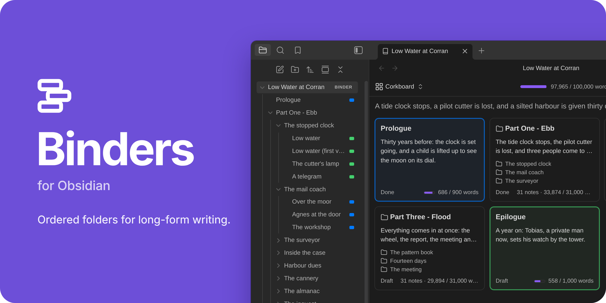
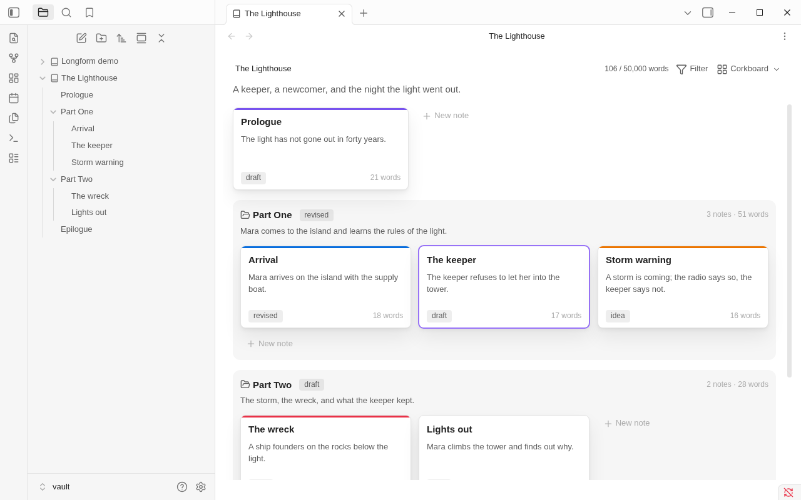
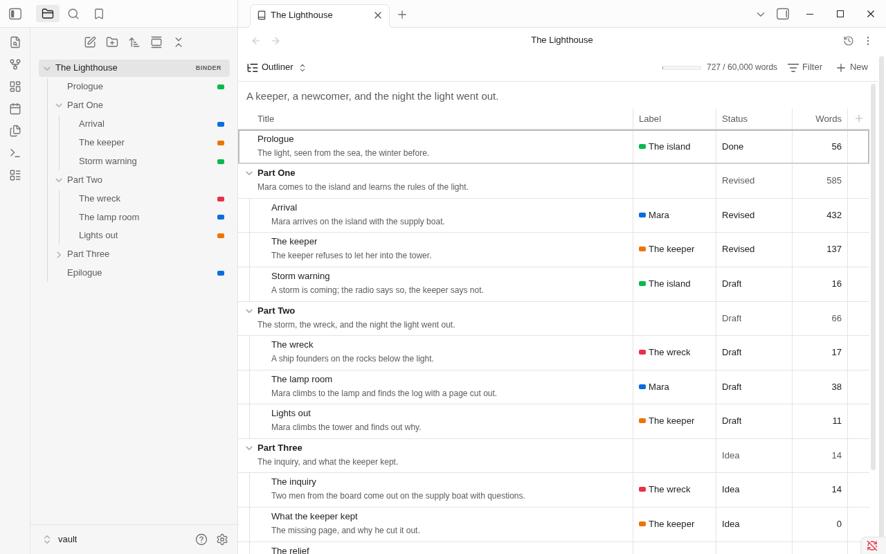
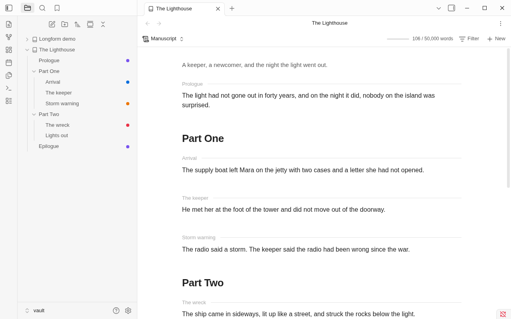

<h1 align="center">Binders for Obsidian</h1>

<p align="center"></p>

<p align="center">A binder in the file explorer · a corkboard · an outliner · the whole manuscript as one editable page</p>

Folders in Obsidian list their notes by name. Books don't work that way. Binders turns a folder into a **binder**: its
chapters and scenes keep the order you give them, in Obsidian's own file explorer. Open a binder to see the same notes
as a corkboard, an outliner, or one continuous manuscript you can edit.

Everything stays plain Markdown. A binder is a folder plus one note that holds its order, and everything about a scene
is in that scene's own properties. Turn Binders off and your notes are still ordinary notes.

> **Public beta.** Binders is in public beta. Phone and tablet support is new and has had little testing on real
> devices. Report what you find in the [issue tracker](https://github.com/fyresmith/binders/issues).

## What it does

- **Order.** Notes and folders keep the order you give them, in the file explorer and everywhere else.
- **Three views of one binder.** A corkboard of index cards, an outliner with columns you pick, and the whole
  manuscript as one page you can edit.
- **Scrivener-style tools.** Labels, statuses and word count targets; an inspector; split, merge, duplicate and
  group scenes; snapshots of a scene, so you can rewrite without losing the old text; undo of moves.
- **Export.** A submission manuscript as a Word file in standard manuscript format, an ebook (EPUB) for Kindle,
  Apple Books and Kobo, the binder itself as a Scrivener project, or the whole binder as one note.
- **Focus mode.** The text and nothing else, with typewriter scrolling.
- **Longform.** Longform projects open as binders, and convert to them.
- **Phones and tablets.** The same views, by touch, on iOS and Android.

The [manual](docs/README.md) covers all of it.

## Installation

Binders needs Obsidian 1.13.4 or later, on a computer, a phone or a tablet.

- **From Obsidian:** open **Settings → Community plugins → Browse**, search for **Binders**, then **Install** and
  **Enable**. <!-- directory link: to be added -->
- **By hand:** download `main.js`, `manifest.json` and `styles.css` from the
  [latest release](https://github.com/fyresmith/binders/releases/latest), put them in
  `<your vault>/.obsidian/plugins/binders/`, and enable **Binders** under **Settings → Community plugins**.
- **From source:** `npm install`, then `npm run build`; see [Development](docs/dev/development.md).

More in [Installation](docs/installation.md).

## Getting started

1. **Make a folder a binder.** Right-click a folder in the file explorer and choose **Make this folder a binder**.
   Its notes and subfolders keep the order they show in now.
2. **Arrange its scenes.** Click the folder. The binder view opens on it as a corkboard. Drag the cards into the
   order you want.
3. **Switch to Manuscript and write.** Click **Corkboard** at the top left of the view and choose **Manuscript**.
   The whole binder is one page, and each section is the note itself.

The [walkthrough](docs/getting-started.md) goes on from here to a first exported file.

## Three views

### Corkboard

One index card per note, with its title, synopsis, status, label color and word count. Drag cards to reorder them,
or lay them out by label to see how a book's threads take turns. [More](docs/corkboard.md)



### Outliner

The same notes as rows of a table, folders with their notes under them, with columns you pick: label, status,
words, target, progress, or any property of your notes. [More](docs/outliner.md)



### Manuscript

Every note in order as one page. Each section is a real Obsidian editor on that note, so typing, undo, links and
formatting work as they do in the note itself. [More](docs/manuscript.md)



## Your files

A binder is a folder with a binder note, named like the folder, whose `contents` property is the order:

```yaml
---
binder: 1
contents:
  - Prologue
  - Part One/
  - Part One/Arrival
  - Epilogue
---
```

Each scene is an ordinary note, and what its card shows (`synopsis`, `status`, `label`, `target`) are its
properties. Binders writes only its own properties and the ones you edit through its views. It doesn't rewrite a
note's text unless you type there or ask it to: split, merge, bring back a snapshot.
[How your files look](docs/files.md) has the whole account.

## Limitations

- **Public beta.** Phone and tablet support has had little testing on real devices.
- **Other file explorers.** Plugins that replace the file explorer, such as Notebook Navigator, don't show binder
  order. The binder view works either way.
- **Obsidian internals.** Binder order in the file explorer and the editable manuscript rely on parts of Obsidian
  outside its plugin API. If an update changes one, Binders falls back (name order, a read-only manuscript) and
  says so.
- **Snapshots and Obsidian Sync.** Sync carries snapshots only with "Sync all other types" turned on.
- **Not built yet:** a paperback PDF, import from Scrivener, and find and replace across the manuscript. See the
  [roadmap](ROADMAP.md).

The full list is in [Known limitations](docs/limitations.md).

## Privacy

Binders makes no network requests and has no telemetry. [More](docs/privacy.md)

## Documentation

| | |
|---|---|
| [Manual](docs/README.md) | Everything Binders does, a page per topic |
| [Getting started](docs/getting-started.md) | From an empty folder to a first exported file |
| [The binder view](docs/binder-view.md) | Corkboard, outliner, manuscript, the inspector |
| [Export](docs/export.md) | Manuscript, ebook, Scrivener project, one note |
| [Snapshots](docs/snapshots.md) · [Focus mode](docs/focus-mode.md) | Rewriting safely, and writing with nothing else on the screen |
| [Coming from Scrivener](docs/scrivener.md) · [Coming from Longform](docs/longform.md) | Where each thing you know is |
| [Commands](docs/commands.md) · [Settings](docs/settings.md) | Reference |
| [Troubleshooting](docs/troubleshooting.md) · [Questions and answers](docs/faq.md) | When something isn't as you expect |
| [Roadmap](ROADMAP.md) · [Changelog](CHANGELOG.md) | What's planned, and what changed |
| [Contributing](AGENTS.md) · [Design and architecture](docs/dev/) | For contributors |
| [Issues](https://github.com/fyresmith/binders/issues) | Report a problem or ask for something |

## License

[MIT](LICENSE). The hyphenation patterns, typefaces and libraries inside the plugin are others' work, under their own
licences: [third-party notices](THIRD-PARTY-NOTICES.md).
