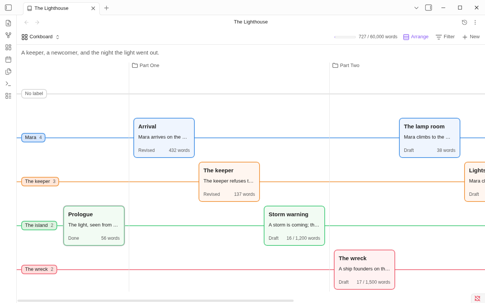
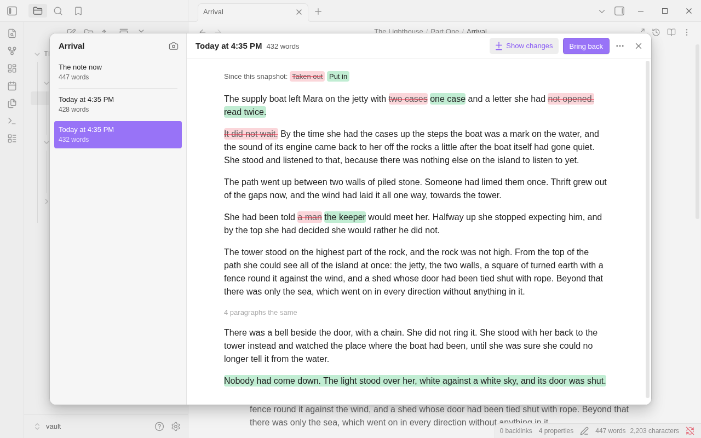
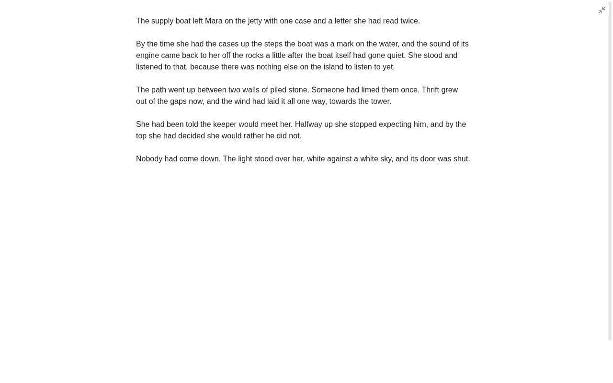
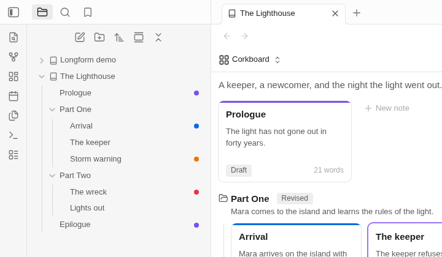
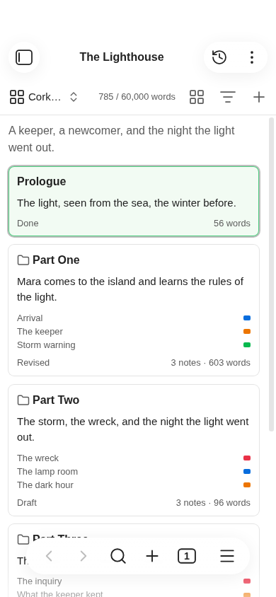

<h1 align="center">Binders</h1>

<p align="center"><b>Ordered folders for long-form writing, inside Obsidian.</b><br>
A binder in the file explorer · a corkboard · an outliner · the whole manuscript as one editable page</p>

Folders in Obsidian list their notes by name. Books don't work that way. Binders turns a folder into a **binder**: its
chapters and scenes keep the order you give them, in Obsidian's own file explorer. Open a binder to see the same notes
as a corkboard, an outliner, or one continuous manuscript you can edit.

Everything stays plain Markdown. A binder is a folder plus one note that holds its order, and everything about a scene
is in that scene's own properties. Turn Binders off and your notes are still ordinary notes.


What it does, in short:

- **Order.** Notes and folders keep the order you give them, in the file explorer and everywhere else.
- **Three views of one binder.** A corkboard of index cards (which can also be laid out by label, a line for each
  storyline or point of view), an outliner with columns you pick, and the whole manuscript as one page you can edit.
- **Scrivener-style tools.** Labels, statuses and word count targets; split, merge, duplicate and group scenes;
  snapshots of a scene so you can rewrite without losing the old text; undo of moves.
- **Export.** A submission manuscript as a Word file in standard manuscript format, or the whole binder as one note.
  (An ebook, a paperback PDF and a Scrivener project are on the way.)
- **Focus mode.** The text and nothing else, with typewriter scrolling.
- **Longform.** Longform projects open as binders, and convert to them.
- **Phones and tablets.** The same views, by touch (so far tested only in Obsidian's mobile emulation: see
  [Known limitations](#known-limitations)).

## Getting started

1. Right-click a folder in the file explorer and choose **Make this folder a binder**. Its notes and subfolders keep the
   order they show in now. Or start a new one: the **New binder** command, or **New binder** beside **New note** and **New folder** in the menu of
   the file explorer's empty space (and of any folder that isn't in a binder).
2. Click the folder. The binder view opens on it, as a corkboard. A click that opens a folder's view doesn't fold the
   folder; click it again, or its arrow, to fold it.
3. Drag cards into the order you want, or drag the notes themselves up and down in the file explorer. Each follows
   the other.

To add a scene, use **New note** at the end of the corkboard, **New** in the view's toolbar (which makes
folders too), or **New scene here** in the folder's right-click menu or the command palette.

## The binder view

One view, three ways of seeing the notes in a binder or in one of its folders. Switch with the button at the top left,
or with the commands **Show corkboard**, **Show outliner** and **Show manuscript**. The view's **More options** menu
(the three dots in its header) has the same, the arrangement of the corkboard, **Undo** and **Redo** of the last move,
**Export...**, and **Open binder note** (or **Open folder note**, inside a folder), which is how you reach the note that
holds a binder's data when it is hidden in the file explorer. Inside a folder, the breadcrumb
beside it goes back up to the binder. The word count shows the target of the binder or folder, if it has one, with a
bar for how far along it is. Click the text under the toolbar to write a synopsis of the binder or folder. Each mode
keeps its place when you look at another, and when you open a note and come back.

### Corkboard

One index card per note, in order, with its title, synopsis, status, label color and word count (and, for a note with
a target, how far along it is). A folder is one card too, with a folder icon, its own synopsis, the names of the
first five things in it (notes and folders only, each with its label color: a picture or a PDF kept beside them isn't
named) and the count of what it holds: double-click it (or tap its name) to
go into it, and use the breadcrumb above the board to come back out. A folder with no synopsis gets one from **Edit
synopsis** in its menu (on a phone, a selected folder card offers **Add a synopsis** itself). So the board is always one folder's items, in one order.

- Drag cards to reorder them, onto a folder's card to move them into that folder, or onto a folder in the breadcrumb to move
  them out to it. The card follows the pointer,
  a line shows where it will go, and the others glide aside when you let go. Shift-click or Ctrl-click (Cmd-click on
  macOS) selects several, and they move together.
- Click a card to select it; click a selected card's synopsis to edit it. Right-click a card to rename it, set its status, label or target, duplicate
  it, move it (**Move up**, **Move down**, or **Move to** any folder of the binder) or delete it; the menu also has what Obsidian and your other plugins offer for that note (bookmark it,
  reveal it in the file explorer, and so on).
- Right-click the board itself for a new note or folder, the card size (small, medium or large),
  **Number the cards** (each note's place in the order), and **Tint cards with their label color** (on as it comes: a
  labeled card has its border and, faintly, its face in that color, as a colored card on a canvas; turn it off for the
  border alone).
- Drag a card out of the view to use it as a note anywhere Obsidian takes one: onto the file explorer to move it, into an open note
  to link it, onto a canvas, a tab or the bookmarks. (Not on a phone.)
- Double-click a card, or press Enter, to open the note. Ctrl-double-click (Cmd on macOS) or a middle
  click opens it in a new tab.
- With the keyboard: arrow keys move between cards, Home and End go to the first and last, Alt+arrows move a card, F2
  renames, Delete asks before deleting, Shift+F10 opens the card's menu, Esc goes back to one selected card. Ctrl+arrows (Cmd on macOS) move the focus without changing the selection, and
  Space adds the focused card to it or takes it out.

#### Arrange by label



**Arrange** in the toolbar shows the same cards by label instead of **In a grid**: one line for each label, and
the cards along the lines in the binder's order, each in a place of its own, on its label's line. It shows which
thread (a storyline, a point of view, a character) each scene is on, and how the threads take turns through the
book. Cards with no label are on the first line; then come the labels from settings, in their order.

The menu is always the same: **In a grid**, **By label, across** and **By label, down**, one of them ticked, then
**Show notes in subfolders** and **Show unused labels**. The button's icon shows which arrangement is on.

- **Drag a card to another line** to give it that line's label: the card takes the line's color as you hold it
  there, and the label's name shows beside it. **Drag it along the lines** to change its place in the binder. Do
  both at once and it does both. Several selected cards go together. **Undo last move** takes the label and the
  place back as one change.
- The lines run **across** or **down**. They stand as far apart as the pane has room for; when there are many they
  close up, and the cards pass each other.
- **Show unused labels** (on as it comes) keeps a line for every label, so there's always one to drop a card on;
  turn it off to see only the labels in use. **Show notes in subfolders** (off as it comes) shows every note under
  the folder, each subfolder's after its name, instead of one card per subfolder. The menu stays open while you
  turn these on and off. In the grid they're greyed out: they are about the lines.
- Click a line's name for its menu: **New note with this label**, **Select its notes**, **New label...** (a name and
  a color, added to the labels in settings) and **Edit labels...**. Double-click a line where there's no card to
  make a note there, with that line's label.
- With the keyboard: the arrows along the lines go through the binder's order, the arrows across them to the
  nearest card on the next line. Alt with an arrow along the lines moves the card; Alt with an arrow across them
  gives it the next line's label. Enter, F2, Delete and Shift+F10 are as in the grid.
- The filter, the card size, the numbers and the tint are the corkboard's own, and apply here too. The command
  **Arrange corkboard by label** goes from the grid to the lines (the way they last ran) and back. It works in a
  Longform project as well.

### Outliner


The same notes as rows of a table, folders with their notes under them, in binder order. The title comes first, with
the synopsis under it (**Show synopses** turns that off); the other columns are yours to pick.

- **Columns:** label, status, words, target, progress, export, created and modified, and any property of your notes
  (a POV, a date). Add and remove them with **+** at the end of the header row. Drag a header to move its column, and
  its edge to resize it.
- **Sorting:** click a header to sort by it: ascending, then descending, then binder order again. Right-click it
  for the same as a menu. Sorting only changes what you see, within each folder; the binder's order stays as it is,
  unless you choose **Make this the binder order** in that menu.
- **Editing:** F2 renames a row. On a selected row, click a label or status for its menu, or the synopsis, a target
  or a property to type in it; with several rows selected, the change is made to all of them. Ticks (export, and
  yes/no properties) change with a click.
- **Folders** fold with the arrow beside them (**Expand all** and **Collapse all** are in the view's **More options**). A folder's row adds up the words of the notes in it, and their targets
  if it has none of its own; the last row does the same for everything shown.
- **Rows** are selected, dragged and right-clicked as cards are: drag between two rows, onto a folder, or below
  everything. Rows can't be dragged while the outliner is sorted.
- With the keyboard: Up and Down move between rows (Home, End, Page Up and Page Down go further), Left and Right fold and unfold, Space folds, Enter opens,
  Ctrl+A (Cmd+A on macOS) selects all, Delete asks before deleting, and typing a name's first letters goes to its
  row. Right goes on into a row's cells, where the arrows move from cell to cell and Enter opens the cell's menu or
  field. Alt+Up and Alt+Down move the selected rows; Alt+Left takes them out of their folder, Alt+Right puts them in
  the folder above.

### Manuscript


Every note in the binder or folder, in order, as one page: folder names as headings, each note's title above its text.
Each section is a real Obsidian editor on that note, so typing, undo, links, formatting and commands work as they do in
the note itself, and every keystroke is saved to that note. Properties are hidden here; the corkboard and outliner
edit them.

- Arrow keys move on into the next note and back. Page Up and Page Down move a screen at a time, and Ctrl+Home and
  Ctrl+End (Cmd on macOS) go to the start and end of the whole manuscript.
- Click a note's title (or press F2 in it) to rename it; Ctrl-click (Cmd-click on macOS) opens the note. Right-click it for the menu
  its card has: status, label, a new note after it, move up or down, delete, snapshots. A folder's heading opens that folder.

Long binders stay quick: only the sections near the screen are live editors, and the rest show as rendered text until
you scroll to them. On a phone a section is rendered text until you tap it: the caret goes to the letter you tapped
and the keyboard opens. Rendered text stands as its editor will, line for line, so the page doesn't move when you
click into a section; footnotes are shown there as the editor shows them (each one's text where you wrote it, small,
and `[^1]` in the line), not as a list at the foot.

## Paragraphs

Obsidian shows a line that starts with a tab as a block of code: grey, in the code font, with `*stress*` and
`[[links]]` left as you typed them. That is Markdown's rule, and Obsidian has no setting for it. For a writer who
starts a paragraph with Tab it is the wrong answer every time.

- **A tab starts a paragraph.** In a binder's notes, a line that starts with a tab (or four spaces) is shown as what
  you meant: a paragraph of your text with its first line indented. Italics, bold and links work in it, and
  spell-check is on. This is so in a note's own tab (live preview, source mode and reading view), in the manuscript,
  in an embed and a hover preview, in the snapshots dialog and in focus mode. On to begin with; **Start a paragraph
  with a tab** in settings turns it off. The note keeps the tab you typed: nothing is added or taken away.
- **Indent paragraphs** (off to begin with) sets in the first line of every paragraph that follows another, as a
  printed book does, without you typing anything, and with nothing added to the note. The first paragraph of a note,
  and one after a heading, a rule, a list, a quote or an embedded picture, starts at the margin. On a phone, which
  has no Tab key, this is the way to an indented page.
- Both are the same width (`--binders-paragraph-indent`, 1.5em, which a theme or a CSS snippet can change), so a
  tab you typed and an indent you didn't look alike, and a paragraph is never indented twice.

What to know about a paragraph that starts with a tab:

- **It is still code to everything but Binders.** The same note outside a binder, another Markdown app, Obsidian
  Publish or a converter will show it as a code block. To Markdown that is what the file says.
- **Links in it follow a rename, but Obsidian doesn't track them.** Obsidian's index takes the line for code, so a
  link there isn't among a note's backlinks or in the graph, and a `#tag` there isn't in the tag list. When a note
  or a file is renamed or moved, Binders updates the links to it in such paragraphs (when Obsidian's **Automatically
  update internal links** is on, and only in a binder's notes), as Obsidian does for every other link. A link that
  could have meant another file of the same name is left as it is.
- **A real indented code block** in a binder's note is shown as text. Use a fenced block (three backticks) for code:
  those are untouched.
- Under a list item or inside a quote, a tabbed line belongs to the list or the quote, as Markdown has it.
- With Obsidian's **Strict line breaks** on, a tabbed line straight under another line of the same paragraph runs on
  with it in reading view, as any line does there.

## Labels, statuses and targets

- **Labels** are a name and a color (Red, Blue… to start with). Change, reorder, add and remove them in settings; a
  color is one of your theme's own, or any color you pick. **Set label** on a card or row also has **Custom
  color…**, for a color on that note alone. A label shows as the border and tint of its card, a dot in the outliner, and
  a dot beside the note in the file explorer.
- **Statuses** are a list in settings too (Idea, Draft, Revised, Done to start with). **New status...** in the menu
  takes any other.
- **Targets:** **Set target...** gives a note or a folder a word count to reach. Click the word count in the toolbar
  to set the target of the folder you're in (on the binder itself, the binder's). Cards, folder headings, the
  outliner's Target and Progress columns and the toolbar show how far along each is.
- The **Filter** button shows only the notes with a given status or label, in all three modes.
- Renaming a label or a status in settings offers to rename it in the notes that have it.

## Splitting and merging

- **Split scene at cursor** (a command, in a note or in the manuscript) moves the text from the cursor on into a new
  note right after this one. **Split scene with selection as title** names the new note from the selected words.
  Undo in the note you split (Ctrl+Z) takes the whole split back: the text returns and the new note goes to the
  trash; redo splits again. A new note you have already edited, renamed or moved stays, and a notice says the text is
  then in both.
- Select several notes and their menu offers to merge them (**Merge 3 notes**): their text and synopses are joined
  into the first, in binder order, and the others go to the trash once the merged note has been checked to hold all
  their text.
- If Obsidian is set to update links automatically (Files and links), links to a merged-away note, or to a heading
  or block that moved in a split, are pointed at the note that has that text now. If it isn't, the merge says how
  many links will stop working before you confirm.
- The same menu has **Duplicate**, **New folder from selection** (or **Put in a new folder**), **Ungroup** on a
  folder, and **Set synopsis from text**, which takes a note's opening lines.
- **Ungroup** moves what a folder holds out to where the folder stood, and the emptied folder goes to the trash with
  its synopsis, label and target. **Undo last move** brings the folder back with all of them and puts its notes
  back inside, in order. A folder stays if something is still in it: text you wrote in its folder note, say.

## Export

What Scrivener calls Compile. **Export binder** (a command) and **Export...** (in the binder view's **More
options** menu, and in the menu of a binder or of a folder in one) open one window: on the left what to make and its
few choices, on the right what it will be. It opens on the kind you made last, and nothing has to be decided before
the first file. Export reads your notes and writes the exported file: your notes aren't changed.

Two kinds are built so far. An ebook, a paperback PDF and a Scrivener project are still to come (see the
[roadmap](ROADMAP.md)).

### Manuscript

A Word file (.docx) in standard manuscript format, the form agents and editors ask for: 12-point Times New Roman,
double-spaced, one-inch margins, a half-inch first-line indent, a header with your surname, the title and the page
number, a title page with your contact details and the word count rounded, each chapter on a new page a third of the
way down, and `#` between scenes.

- **Real Word styles.** Chapters are Heading 1, scene breaks have a style of their own, footnotes are Word footnotes
  and links are links, so the file can be restyled in Word, or brought into Vellum or Atticus.
- **Style:** Standard manuscript; Standard manuscript, Courier (italics underlined); or Plain, for a typesetter
  (single-spaced, no title page or header, `***` between scenes).
- **Your name** is asked for once, in the window. It and your contact details are kept in Binders' settings. A binder
  note can say `title:` and `author:` for one book.
- **Front and back matter** (a dedication, acknowledgements) are left out of a manuscript unless you turn them on.
- **The preview** is the manuscript's text as it will read, on paper: the headings, the breaks and the notes, not
  the pages. Word sets its own lines and turns its own pages.

**How a binder becomes a book.** Every note and folder plays a part: a part, a chapter, a scene, front or back
matter. Binders works it out from the binder's shape:

- Top folders named "Part", "Book" or "Act": folders are parts, notes are chapters.
- Other folders, one level deep: folders are chapters, and the notes in them are scenes, joined with a scene break.
  A note at the top is a chapter by itself.
- Folders in folders: parts, chapters and scenes.
- No folders (and a Longform project): every note is a chapter.

**Contents**, in the window, lists every item with the part it was given. A chapter is numbered ("Chapter One")
unless it is named Prologue, Epilogue, Interlude, Introduction, Foreword, Preface or Afterword. Its title is its
note's or folder's name without a number it starts with ("03 - Storm warning" is "Storm warning"), and nothing if the
name is only a number or "Chapter 3"; a level-one heading at the top of the note is the title instead. Notes at the
start or the end named Dedication, Epigraph, Acknowledgements, About the author, Also by, Copyright or Title page,
and everything in a folder named "Front matter" or "Back matter", are front and back matter. To overrule any of it,
give a note (or a folder's note) the property `export-as: chapter` (or `part`, `scene`, `front matter`,
`back matter`), and a binder note `structure:` (see [docs/file-format.md](docs/file-format.md)). A menu for both is
on the way.

**What your Markdown becomes.** Properties are never exported. A new line is a new paragraph, and a tab or spaces at
a paragraph's start are dropped (the manuscript indents every paragraph itself); two spaces or a backslash at a
line's end break a line. Italic, bold and strikethrough stay. Straight quotes are curled, `--` is a dash and `...`
an ellipsis. `---`, `***` or `___` alone on a line, and the join of two scenes, are a scene break. A heading inside a
note is a subheading. A link to a note is its words; a web link is a link. Footnotes (`[^1]` and `^[typed in
place]`) are footnotes. Comments (`%% %%` and `<!-- -->`), block ids and lines of nothing but tags are left out;
highlights are their words; a callout is a quotation with its title in bold. Quotations, lists, tables and fenced
code stay what they are. `![[A note]]` brings in that note's text, one level deep, and a PNG, JPEG or GIF picture is
set in the page.

**What can't be exported is counted first.** Under the choices the window lists each thing it will leave out or
change, with the note it is in: a picture that isn't found (or isn't a PNG, JPEG or GIF), an embedded PDF or other
file, part of a note embedded by its heading, math and a tag in a line of text (both exported as typed), HTML (its
text is kept), a folder deeper than the structure reaches. Click one to open its note.

**Where the file goes.** On a computer, Export opens your system's save dialog, starting in a folder named `Exports`
beside the binder. This is the one place Binders writes outside your vault, and only where you say. Once a file is
saved the window says where, with **Show in folder** and **Open**, and offers **Save here next time without
asking**: ticked, later manuscripts of that binder go straight there (a file there that export didn't write, or that
has been changed since, is asked about first). **Choose where to save...** in the window's menu, unticking the box,
or **Ask again** in Binders' settings brings the dialog back. On a phone or tablet the file goes into the `Exports`
folder in your vault, and then to the share sheet. Obsidian lists a .docx in its file explorer only with **Detect
all file extensions** on (Files and links). The Exports folder can be renamed, or made one folder for the whole
vault, in settings.

Not there yet: the ebook, the PDF and the Scrivener project; the book's own details (subtitle, cover, copyright
line, language) and a menu for a note's role; editing a style; pictures in other formats. The Word file has been
opened in LibreOffice; it hasn't yet been checked in Word, Pages or Google Docs.

### One note

The whole binder, or the folder shown, as one Markdown note beside the binder (this was "Compile"). You choose the
title, whether folders and note titles become headings, what goes between notes, whether comments are left out, and
whether the tabs that start paragraphs are taken off (outside a binder Obsidian shows such a line as code). **Copy**
copies the text instead of saving it. Exporting again offers the same note, and replaces the last one; a note that
has been written in since, or wasn't made by an export, is asked about first.

### Leaving a note out

Turn off **Include in export** on a note or folder (its menu, or the outliner's **Export** column) to leave it out
of every kind of export.

## Snapshots



A snapshot is a note's text as it was, set aside so you can rewrite without losing anything. Only notes in a binder
have them. The three things below are in a note's own menu and in the file explorer's, behind a **Snapshots** button (a clock) in the
header of any note of a binder, and under **Snapshots** in the menu of a card, an outliner row or a manuscript title;
each is a command too.

- **Take a snapshot** (a note's menu, or the command) keeps the text as it is on screen now. It asks nothing; if
  nothing has changed since the last snapshot, it says so and takes none. Select several notes to take one of each,
  or choose **Take a snapshot of every note...** on a folder or the binder to take them all at one moment under one
  name, such as "Draft sent to Sam".
- **Rewrite...** takes a snapshot (give it a name if you like), then lets you start again: from the same text, or
  from a blank page. After a blank page the old text opens beside the note (on a phone it's under Snapshots).
  Undo in the note brings the text back.
- **Show snapshots...** (the command is **Show snapshots**) lists a note's snapshots, newest first, under the note as it is now. Read one, turn on **Show
  changes** to see what was taken out and put in since (the note's own paragraphs, with the words taken out struck
  through and the words put in marked where they fall), or **Bring back** its text. Bringing one back never loses the
  text it replaces: that's taken as a snapshot first. The menu beside it copies a snapshot's text (or select part of
  it and copy that), names it, opens it to the right of the note, or deletes it (to the trash). The camera over the
  list takes a snapshot of the note as it is now; with none yet, the dialog says what a snapshot is and offers to
  take the first.

Snapshots are plain-text files (Markdown inside) in a `Snapshots` folder in the binder, one folder per note:
`The Lighthouse/Snapshots/Part One/Arrival/2026-10-01 14.32.07 First draft.snapshot`. They follow the note when you
rename or move it. They're kept out of your way: never in a binder's order, word counts or exports, never listed
in the file explorer, and (not being notes) not in search, the quick switcher, backlinks, the graph or tags. When a
note is deleted its snapshots stay; the binder view's menu lists **Snapshots of notes that are gone**.

Three things to know:

- **Obsidian Sync skips snapshots unless you turn on "Sync all other types"** in Obsidian's Sync settings, on each
  device. Until you do, snapshots stay on the device that took them. Tools that copy every file in the vault (iCloud,
  Syncthing, Dropbox, git) carry them without any setting.
- Obsidian's own folder lists ("Move file to...") do show the `Snapshots` folders, and with "Detect all file
  extensions" turned on, a search by file name finds them.
- Without Binders, they're still there: open a `.snapshot` file in any text editor.

## Focus mode



For writing a note of a binder with nothing else on the screen: the text, in your vault's own type and line length, and
one button to leave. **Toggle focus mode** in the command palette (give it a hotkey of your own), the button in the
header of any note of a binder (**Focus mode**), or the button at the end of the manuscript's toolbar goes in; **Esc**, the button that
comes back when the pointer moves (top right), or the command goes out. It works for a note in its own tab, editing or
reading, and for the manuscript. A note that isn't in a binder is left exactly as Obsidian has it.

Nothing of Obsidian's is closed or rearranged to do this: the sidebars, tabs, other panes and the status bar are out
of sight while you write, and exactly where they were when you leave. Dialogs, menus and the command palette open
over the page as usual, and take Esc first. With Vim key bindings on, Esc is Vim's; use the button or the command.

**Typewriter scrolling** and **Dim other paragraphs** are on to begin with. Typewriter scrolling: while you write at
the end of a scene, the line you're on stays at one height, a little above the middle, and the page moves under it. Go
back up to change something and the page scrolls as it always does; the page never moves because you clicked.

Everything else is off until you turn it on, in Binders' settings or in focus mode's own menu (right-click the leave
button or the text, or click the word counts):

- **Show the scenes before and after:** in a note, the end of the scene before is shown above its text and the start
  of the scene after below it, as in the manuscript. Click one to go there.
- **Show where you are:** the scene's place in the binder ("Part One › Arrival") and its synopsis, as a note in the
  margin, or a strip along the top where there's no margin.
- **Show word counts:** the scene's words, with its target, and the words written today in the binder, where the
  status bar was. They go while you type and come back when you pause.
- **Words to write today:** a goal for the day. When it's reached the count turns the color of a target met, and
  nothing else happens.
- **Dim other paragraphs** (on to begin with): while you type, every paragraph but the one you're in steps back;
  moving the pointer brings them forward again.
- **Enter fullscreen:** focus mode takes the whole screen and gives it back when you leave. Esc leaves both. Not
  on phones and tablets.

**Go to previous scene** and **Go to next scene** (commands, for a note of a binder or in the manuscript) move through
the binder in its order without leaving focus.

The words written today are the day's net change in the binder's notes, counted whether you're in focus or not. They
are kept on the device you write on, not in your notes and not in the plugin's settings, so they don't sync: each
device counts its own. **Start counting from here**, in the menu, starts the day again.

## Undoing a move

**Undo last move** and **Redo last move** work on one binder at a time: the one in front (or the one the open note is
in), and with neither, the binder changed last. A move made in another binder is not the one taken back. They take back, or make again, a drag, a **Move up** or **Move down**, a sort
kept as the binder's order, a folder made around notes (or taken away from them: an ungrouped folder comes back from undo with its synopsis, label and target), or a card dragged to another
label's line on the corkboard: each note goes back beside the neighbours it had, to the folder it was in, and to the
label it had. Whatever you renamed or added since stays as it is. In the binder
view, Ctrl+Z and Ctrl+Shift+Z (Cmd on macOS) do the same when you aren't typing. Undo of text is still the editor's
own.

## The file explorer



- Binders show in their own order in Obsidian's file explorer. A binder folder says **binder** at the end of its row,
  as a canvas says “canvas”, and the folder a binder view is showing is marked there as the open note is.
- Clicking a binder, or a folder in one, opens it in the binder view and still expands it. Ctrl-click (Cmd-click on
  macOS) or middle-click opens it in a new tab.
- The binder note and folder notes are hidden, since the binder view shows what they hold. A setting shows them.
- Drag a note or folder between two others to put it there, in the same folder or another: a line shows where it
  will go, and a hint says so. Dropping onto the middle of a folder still moves it into that folder, as always.
  (Dragging below an open folder's name puts it first in that folder; below a folder's last item, further left
  puts it after the folder.) Several dragged together arrive in the order they show in. A drop that can't be made,
  such as onto a folder that already has a note of that name, says why.
- Labeled notes and folders show a dot in their label's color. A setting turns the dots off.
- A note's right-click menu has **Show in binder** and **New scene after this**; several notes selected have **New
  folder from selection** and **Merge 3 notes** (or however many). A binder folder's menu has **Open binder**, **New
  scene here** and **Export...**; any folder that isn't in a binder has **Make this folder a binder** and **New
  binder**.
- **Move up** and **Move down** in a note's right-click menu (and as commands) move it one place in its folder.
- **Open binder** opens the binder view from any note in it, with that note's card selected.

## How the files look

A binder is a folder with a **binder note**, named like the folder (`The Lighthouse/The Lighthouse.md`). Its
`contents` property is the order, as paths inside the binder:

```yaml
---
binder: 1
contents:
  - Prologue
  - Part One/
  - Part One/Arrival
  - Part One/The keeper
  - Epilogue
target: 50000
synopsis: A keeper, a newcomer, and the night the light went out.
---
Anything you like: notes on the book, links, a to-do list.
```

Each scene is an ordinary note. What the cards and the outliner show are its properties:

```yaml
---
synopsis: Mara arrives on the island with the supply boat.
status: Revised
label: Blue
target: 1200
---
The supply boat left Mara on the jetty with two cases and a letter she had not opened.
```

`label` is the name of a label from settings, one of the theme's colors (`blue`), or a color of its own (`#7c3aed`).
`export: false` leaves a note out when the binder is exported (`compile: false`, its name in earlier versions, still
does).

A subfolder can have a **folder note** named like it (`Part One/Part One.md`) for its own synopsis, status, label and
target. Binders creates it the first time you give the folder one of these.

Binders changes only `contents` and its own properties in the binder note, and only the properties you edit in its views
in your notes. Renaming, moving or deleting notes anywhere in Obsidian keeps the order up to date. Notes the order
doesn't mention yet show after the others, by name. The full format is in [docs/file-format.md](docs/file-format.md).

### What Binders writes, and what it never touches

- **In a binder note:** `binder`, `contents`, and `synopsis`, `status`, `label` and `target` for the binder itself.
  Binders makes the note when you make a binder.
- **In a folder note:** the same four, made the first time you give a folder one of them.
- **In your notes:** only the properties you change through its views (`synopsis`, `status`, `label`, `target`,
  `export`, and any property you edit in an outliner cell), through Obsidian's own property writer, so the rest of
  the note stays as it is.
- **Note text** is never rewritten behind your back. It changes only where you type (in a note, or in the manuscript,
  which is Obsidian's own editor), or when you ask: **Split**, **Merge**, **Bring back** a snapshot, **Rewrite**, and
  the links repointed after a merge or split when Obsidian is set to update links. Each is ordered so the text exists
  in two places before it leaves the first.
- **Links in paragraphs that start with a tab**, when the note or file they lead to is renamed or moved, Obsidian is
  set to update links and **Start a paragraph with a tab** is on: the name in the link changes, as Obsidian changes
  it in every other link, and nothing else in the note does. Obsidian doesn't do this itself, because it reads such
  a line as code. This is the one change to a note's text you didn't ask for one by one.
- **New files:** notes you make or duplicate, folder notes, the one note an export makes (beside the binder, never
  in it), snapshots (in the binder's `Snapshots` folder), and exported files: on a computer where the save dialog
  says, otherwise in the `Exports` folder beside the binder. Export changes none of your notes.
- **Files moved or renamed:** only when you move or rename them (dragging in a view or in the file explorer, renaming
  in a view, grouping), and a folder note, which follows its folder when you rename it.
- **A binder from a newer version of Binders** is left exactly as it is, and says why when you try to change it.
- **Nothing is sent anywhere.**

## Longform

Binders shows [Longform](https://github.com/kevboh/longform) projects (multi-scene ones) as binders, in Longform's own
format: the corkboard, outliner and manuscript all work on them, and reordering writes only `longform.scenes`, as
Longform does. Scenes indented under a scene show as a group. **Convert to binder**, in the index note's right-click
menu or the command palette, turns a project into a binder, and can move groups into folders.

## Commands

Open the command palette and type the name. None has a default hotkey: give the ones you use one of your own in
Obsidian's Hotkeys settings. Most only appear where they apply (a binder view in front, a note of a binder open).

| Command | What it does |
|---|---|
| **Open binder** | Opens the binder view on the folder of the open note, with the note's card selected. |
| **Show corkboard**, **Show outliner**, **Show manuscript** | Switch the binder view in front to that mode. |
| **Arrange corkboard by label** | In the corkboard, goes from the grid to the lines by label (as they last ran) and back. |
| **Make this folder a binder** | Turns the open note's folder into a binder. |
| **New binder** | Makes a new folder that is a binder, beside the open note if that's outside a binder, else at the top of the vault. |
| **New scene here** | Makes a note after the open one (or, in a binder view, where the view would put one). |
| **Convert to binder** | For a Longform project: turns it into a binder. |
| **Split scene at cursor**, **Split scene with selection as title** | Move the text from the cursor on into a new note after this one (in a note, or in the manuscript). |
| **Set word count target** | Sets the target of the folder the binder view shows (the binder's own, on the binder). |
| **Export binder** | Opens the Export window for the binder, or the folder shown: a manuscript as a Word file, or one Markdown note. |
| **Undo last move**, **Redo last move** | Take back, or make again, the last move made by hand in the binder in front (or the open note's). |
| **Move up**, **Move down** | Move the open note one place in its folder. |
| **Take a snapshot**, **Rewrite**, **Show snapshots** | Snapshots of the open note (or, in the manuscript, the section the cursor is in). |
| **Take a snapshot of every note in the binder** | One snapshot of each note, at one moment, under one name if you give it one. |
| **Show snapshots of notes that are gone** | Lists the snapshots left by deleted, merged-away or moved-out notes. |
| **Toggle focus mode** | Goes into focus mode, or out of it. |
| **Go to previous scene**, **Go to next scene** | Move through the binder in its order, in focus mode or out of it. |

## Settings

Settings, Community plugins, Binders.

| Setting | What it does |
|---|---|
| Order binders in the file explorer | Show binders in their own order, and drag there to reorder. Turn this off if another plugin replaces the file explorer. |
| Open binders from the file explorer | Clicking a binder, or a folder inside one, opens its binder view. |
| Hide binder and folder notes | Don't list a binder's note, or a folder's note, in the file explorer. Only applies while binder order is on. |
| Show label colors in the file explorer | A dot in its label's color beside each labeled note and folder in a binder. |
| Start a paragraph with a tab | In a binder's notes, a line that starts with a tab is shown as an indented paragraph, not as code, and links in it follow a rename. The note keeps the tab. On to begin with. |
| Indent paragraphs | In a binder's notes, the first line of a paragraph that follows another is indented. Nothing is added to the note. |
| Labels | The labels a note can have: a name and a color each. Add, rename, recolor, reorder and delete them; a reset puts back the defaults. |
| Statuses | The statuses a note can have, in the order a draft goes through them. |
| Typewriter scrolling | (Focus mode.) While you write at the end of a scene, the line you're on stays at one height. On to begin with. |
| Show the scenes before and after | (Focus mode.) In a note, the end of the scene before and the start of the scene after, above and below its text. |
| Show where you are | (Focus mode.) The scene's place in the binder and its synopsis, beside the text. |
| Show word counts | (Focus mode.) The scene's words and the words written today, hidden while you type. |
| Dim other paragraphs | (Focus mode.) While you type, every paragraph but the one you're in steps back. On to begin with. |
| Enter fullscreen | (Focus mode; desktop only.) Focus mode takes the whole screen and gives it back when you leave. |
| Words to write today | (Focus mode.) A goal for a day's writing in a binder, shown with the word counts. Empty for none. |
| Exports folder | (Export.) Where exported files go on a phone or tablet, and where the save dialog starts on a computer. A name is a folder beside each binder; a path, such as `Books/Exports`, is one folder for the whole vault. |
| Remembered places | (Export.) The exports this device saves without asking, with **Ask again** to forget them. |
| Your name, Contact details | (Export.) The author of a book that doesn't say otherwise, and the lines for a manuscript's title page. |
| Synopsis, Status, Label, Target | (Property names.) The properties that hold each, if your notes already use other names. |

A note has a label when its property says that name, so renaming a label or status in settings asks whether to rename
it in the notes that have it too. A few things are remembered outside the settings page: how each binder view was left
(its mode, filter, card size, outliner columns), how **Export** was last set up, and (on each device by itself) the places exports are saved without asking.

## On phones and tablets

Binders is built to work on iOS and Android, but so far it has only been tested in Obsidian's phone and tablet
emulation on a desktop, not on a real device. Tap a card to select it, then tap its synopsis to edit it or its title to open the
note; press and hold for its menu, and hold and drag to move it. Rows in the outliner work the same way (a selected row
or folder card with no synopsis offers **Add a synopsis**; on a note's card, and in a menu, it is **Edit synopsis**). On a phone menus open as Obsidian's own sheets, on a
tablet beside the finger; the manuscript uses Obsidian's editor and its toolbar.

What a mouse and a keyboard do differently there:

- **Several at once:** there's no Shift or Ctrl, so a card's or row's menu has **Select more**: each tap then adds an
  item to the selection or takes it out, and the menu of any of them offers **Merge**, **New folder from selection**
  and the rest. A tap on the empty board ends it.
- **Undo:** **Undo** and **Redo** of the last move are in the view's **More options** menu.
- **Arrange by label:** on a phone the cards are small and the lines run across, their names down the left edge;
  swipe to go along the lines, hold a card and drag it to another line to give it that label. **Arrange** is an icon
  in the toolbar, and its menu a sheet.
- **The outliner's headers:** a tap opens a column's menu (sort, **Move left**, **Move right**, hide); on a phone the
  label column shows the color alone.
- **Targets:** in a pane narrower than 360 px the word count in the toolbar is its number alone (tap it to set the
  target); in an even narrower one it goes, and **Set word count target** in the command palette sets a target there.
- **The file explorer:** on a phone a tap on a binder opens it, and a tap on a folder inside it folds or unfolds it.
- **The manuscript on a phone:** a section is plain text to read and swipe through until you tap it. The tap puts
  the caret on the letter under your finger and opens the keyboard, and the section is its editor for as long as you
  are in it; tap another section and the first goes back to plain text once what you typed is saved. (On a tablet,
  as on a computer, the sections near the screen are editors already.)
- **Typing:** with the keyboard up and little room left (a phone on its side), the toolbar steps aside while you type
  and the manuscript runs under Obsidian's header, as a note does, so more lines are left to write in. Buttons, cards
  and rows are 44 px tall or more, and folders deep in a binder indent by a narrower step, so their names stay readable.
- **Focus mode:** on a phone Obsidian's bar of buttons and the note's header go; the way out is at the top, under the
  clock, with the place and the word counts beside it if they're on. It goes while you type and comes back when you
  touch the page. The keyboard's own toolbar stays. Press and hold the leave button for the menu.



## Compatibility

- Binders changes the order of Obsidian's own file explorer. Plugins that replace the file explorer (such as Notebook
  Navigator) don't show binder order; turn off **Order binders in the file explorer** if you use one. The binder view
  works either way.
- Binders relies on a few parts of Obsidian that aren't in its plugin API (the explorer's sorting and dragging, and
  the editor that embeds notes, as Canvas does). Each is checked when Binders starts: if an Obsidian update changes
  one, the explorer falls back to name order (and dragging there to what it does without Binders), or the manuscript
  to read only, and Binders says so.
- Focus mode hides parts of Obsidian's window by their names in its style sheet. If an update renames one, that part
  stays in sight while you write; nothing else changes.
- Requires Obsidian 1.13.4 or later. Works on desktop, phone and tablet.
- Snapshots are `.snapshot` files. Obsidian Sync only carries them with "Sync all other types" on (see Snapshots).
- Nested binders aren't supported: a binder note inside a binder is treated as an ordinary note. Longform projects that
  hold a single note (`format: single`) aren't binders.

## Known limitations

Binders is not at 1.0 yet. What isn't finished, honestly:

- **Phones and tablets are emulated only.** The behavior has been checked at phone and tablet sizes, upright and on
  their sides, with touch, in Obsidian's emulation on a desktop. It has not been tried on a real iPhone, iPad or
  Android device, so its keyboard handling, suspending and resuming, and Android's back button are unchecked.
- **After Split scene at cursor,** Undo in the note you split takes the split back only while Obsidian stays open
  and Binders stays on: after a restart, or once the note's own undo history is gone, the split is two notes like any
  others. If the note changes in the moment it is being split, both notes keep the text and a notice says so.
- **Setting a property** (a status, a label, a target, a synopsis) goes through Obsidian, which writes the note's whole
  properties block again in its own form: comments in the block are dropped, and `0123` becomes `123`. The same happens
  to a binder note, or a Longform project's index note, when its order is written. Obsidian's own Properties view does
  the same. The note's text is never touched.
- **Windows line breaks.** Binders leaves a note's line breaks alone unless you type in it. Obsidian itself rewrites
  a note that has Windows line breaks with its own when the note's tab is closed or given to another note.
- **In the file explorer,** a selection that spans two folders of a binder, or a Longform project, still has Obsidian's
  own **New folder with selection**, which puts the folder last. Obsidian's **Make a copy** of a folder (or a copy made in a file manager while Obsidian is open) is placed right after the original, in the original's order, and
  keeps the folder's synopsis, label and target: Binders renames the copied folder note to match the copy. A folder note with none of those properties, or one that differs from the original's, is left under its old name and shows in the copy as a scene, listed last.
- **Undo last move** covers moves (and a folder made around notes or ungrouped), not renames, deletes, merges or duplicates (a split is undone in its note, with the editor's own undo), and
  remembers the last fifty changes (of all binders together) while Obsidian is open. Undoing a kept sort of thousands of notes is slow.
- **For screen readers,** the "New note" tile sits inside the list of cards, so a reader may skip its button, and "Undo last move" isn't announced.
- **Not built yet**, before 1.0: export (EPUB, DOCX, PDF and a Scrivener project), import from a Scrivener project, and
  find and replace across the manuscript. See the [roadmap](ROADMAP.md).

If you find something else, it's a bug: open an issue.

## Troubleshooting

- **The file explorer shows my binder in name order.** Check that **Order binders in the file explorer** is on in
  Binders' settings. If another plugin replaces the file explorer (Notebook Navigator and the like), binder order can't
  show there: the binder view still works, and the setting is best turned off. If Binders says "couldn't change the order
  of the file explorer in this version of Obsidian", an Obsidian update has changed something Binders relies on; the
  binder view and the rest still work, and an update to Binders is the fix.
- **I can't find the binder's note, or a folder's note.** They're hidden in the file explorer while **Hide binder and
  folder notes** is on. Open them from the binder view's **More options**, **Open binder note** (or **Open folder
  note**), or turn the setting off.
- **A binder says it is read only, or "can't change" it.** Its note was made by a newer version of Binders (it says
  which format), or its `binder` property holds something Binders doesn't understand. Binders leaves such a binder
  exactly as it is. Update Binders, or fix the property by hand.
- **A note isn't where I put it.** Notes the binder's list doesn't mention show after the listed ones, by name; a new
  note is written into the list when something in its folder is moved. In a Longform project, order is the project's own
  `longform.scenes`.
- **The manuscript is read only.** Binders says "The manuscript can't edit notes in this version of Obsidian". Click a
  section to open its note and edit it there; the rest of Binders is unaffected.
- **My snapshots aren't on my other device.** Obsidian Sync carries `.snapshot` files only with **Sync all other types**
  turned on in Obsidian's Sync settings, on each device. See Snapshots.
- **A Longform project shows Longform's order, not mine.** That is by design: a project keeps its order in
  `longform.scenes`, and Binders writes only that. **Convert to binder** makes it a binder with its own format.
- **Where did the words written today go?** They are kept on the device you write on, not in your notes or settings,
  so each device counts its own. **Start counting from here** in focus mode's menu starts the day again.

## Privacy

Binders makes no network requests and collects nothing. Everything it does happens in your vault's files.

## Documentation

| | |
|---|---|
| [File format](docs/file-format.md) | Binder notes, folder notes, scene properties, Longform projects |
| [Roadmap](ROADMAP.md) | What's left before 1.0: mobile QA on real devices, export, import from Scrivener, find and replace |
| [Plan](docs/plan.md) | The design of every feature, and what's done |
| [Architecture](docs/architecture.md) | A map of the code: modules, layers, how a change travels, what keeps writing safe |
| [Obsidian internals](docs/internals.md) | The undocumented parts of Obsidian Binders uses, and their fallbacks |
| [Design](docs/design.md) | What "native" means here, and how design rounds are run |
| [Development](docs/development.md) | Building, testing, releasing |
| [AGENTS.md](AGENTS.md) | How to contribute: the rules, versioning, tests |

## License

[MIT](LICENSE)
