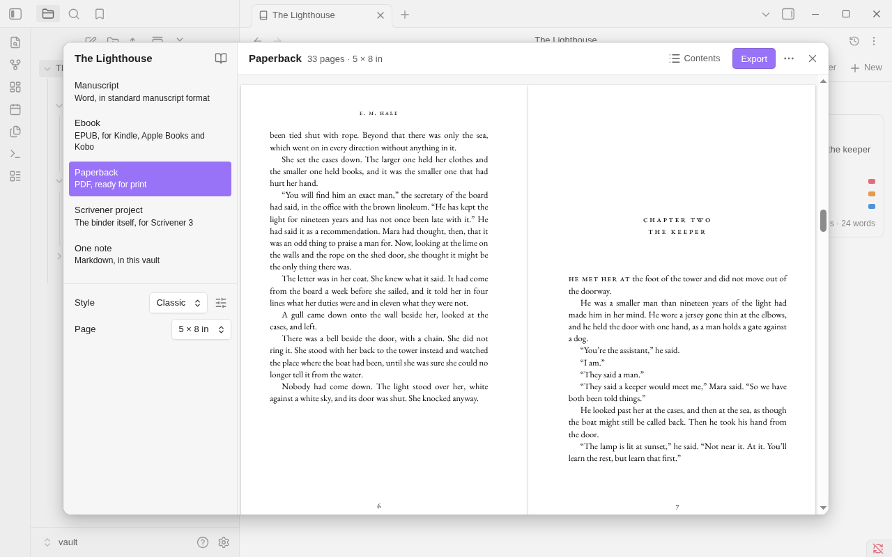

# Paperback (PDF)

A paperback is a print-ready PDF: your book set in a book style on a page of the size it will be printed at, with
its typefaces inside the file. It is what a print-on-demand service such as KDP asks for as the inside of a book.
Choose **Paperback** in the [Export window](export.md).

A PDF is made on a computer. See [On a phone or tablet](#on-a-phone-or-tablet).

## What you get

- The book on the trim size you choose, one page of the book to a sheet of the PDF.
- The title page, the copyright page, the contents with their page numbers, your front and back matter.
- Each chapter opening on a new page, a right-hand one unless the style says otherwise.
- The title or the author along the top, and page numbers. Front matter is numbered in small Roman numerals; the
  text starts at 1.
- Footnotes at the foot of the page their mark is on, numbered from 1 in each chapter.
- Lines justified and hyphenated, where the style asks for it.
- The style's typeface in the file, so the book prints the same anywhere. The text can be selected and searched.

## Choices

| Choice | What it does |
|---|---|
| **Style** | The book style: **Classic**, **Modern**, or one of your own. See below |
| **Page** | The trim size: **5 × 8 in**, **5.25 × 8 in**, **5.5 × 8.5 in**, **6 × 9 in** or **A5** |

Both are kept with the book, in its binder note.

### Styles

| Style | What it is |
|---|---|
| **Classic** | EB Garamond. A centred chapter line in small capitals ("Chapter One") with the chapter's title under it, the first words of a chapter in small capitals, `* * *` between scenes, the author and the title along the top, page numbers at the foot |
| **Modern** | Source Serif. A large plain numeral at the left with the chapter's title under it, space between scenes, the title along the top with the page number beside it at the outside |

The same two styles shape an [ebook](export-ebook.md): choose one for the book and both kinds follow it.

To change a style, or make one of your own, click the sliders button beside **Style** (**Edit this style**). Opened
from Paperback, the editor has the rows that are the pages' own: typeface, size, line spacing, lines, space above a
chapter, where chapters open, what runs along the top, page numbers and margins. See [Styles](export-styles.md).

## The pages, as they will print

For a paperback the right side of the window shows the pages themselves, two facing, as they will print. The line
breaks, the page turns and the page numbers you see are the ones in the file.

- The bar says how many pages the book has and its trim size: "212 pages · 5 × 8 in".
- A long book is laid out as you watch: "Laying out the pages… 120".
- Change the style or the page and the pages are laid out again.

## How pages are made

| In the book | On the page |
|---|---|
| A paragraph | Cut at a line when it must be, with at least two lines left on each page. A paragraph of three lines is never cut |
| A heading inside a note, a scene break | Never the last thing on a page. A break that falls at a page turn shows `* * *` at the top of the next page, even in a style whose breaks are only space |
| A footnote | At the foot of its page, under a short rule. One too long for the page goes on at the foot of the next |
| A quotation, a callout, a list | Set in, and cut like any paragraph |
| A table | Broken between rows. The head row is not repeated on the next page |
| A picture | Scaled down to fit the text's width and the page. Never scaled up |
| A dedication, an epigraph, a part's page, the title and copyright pages | A page of their own, with nothing along the top and no number |

The inside margin grows with the book: a thicker book needs more room at the spine, and Binders gives it what
printers ask for at that page count.

## Hyphenation

Where a style justifies its lines, words are broken at the ends of lines as a printed book breaks them. Binders
carries hyphenation patterns for seven languages:

- English, British and American (American for a book in American or Canadian English, British for any other);
- German, in the reformed spelling;
- French, Spanish, Italian and Portuguese.

A book in another language is set without hyphens: its lines are a little looser, and no word is broken wrongly.
The book's language is set in [Book details](book-details.md).

A style with **Lines** set to **Ragged right** has no hyphens.

## When the typeface doesn't have your letters

The two typefaces inside Binders hold the Latin alphabet, with the accents of European languages and Vietnamese. A
book whose language is written in another script (Cyrillic, Greek, Hebrew, Arabic, Chinese, Japanese, Korean and a
few more) is set in your computer's own serif typeface for that script instead, and the window says so with the
things to look at: "EB Garamond has no Cyrillic letters. The pages are set in this computer's own serif instead."

- The pages you see are still the pages you get.
- Another computer may have another typeface, so the same book can come out differently there.
- A word or two of another script in a Latin book is set in the computer's typeface, letter by letter, without a
  warning.

## On a phone or tablet

A phone or tablet makes no PDF. The kind is there, marked "PDF, made on a computer": you can look at the pages and
choose the style and the page, and there is no **Export**. Export it when the vault is open on a computer.

## How the book is put together

How folders and notes become parts, chapters and scenes, and what your Markdown becomes, is the same for every
book. See [Book details and structure](book-details.md).

## Limits

- A PDF is made on a computer only. Where Obsidian can't print pages to a file, the window says "PDF isn't available
  here" and the pages can still be looked at.
- Lines are broken one at a time, so a line here and there is looser than a typesetter would leave it.
- Facing pages aren't forced to the same depth: a page ends short when what comes next can't be cut.
- The file is RGB and not PDF/X. There is no bleed, there are no crop marks, and the page count isn't made even.
  That suits KDP's paperback; another printer may ask for more.
- A row of a table taller than a page isn't broken, and runs past the foot of its page.
- The two typefaces are the choice. Any other needs the PDF made elsewhere.
- Pictures are PNG, JPEG or GIF.
- The PDF has been made and checked on Linux. It hasn't yet been tried on macOS or Windows, or sent to a printer.
  See [Known limitations](limitations.md#not-yet-tried).

Next: [Scrivener project](export-scrivener.md)
