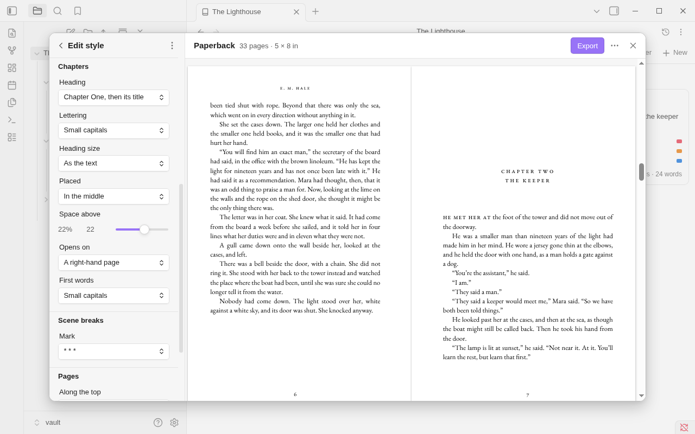

# Styles

A style is how an exported book looks: its chapter headings, its scene breaks, its indents, and on paper its
typeface and its pages. Your notes stay plain, and the style is given when the book is exported.

There are two kinds of style:

- **Book styles** set an [ebook](export-ebook.md) and a [paperback](export-paperback.md). Built in: **Classic** and
  **Modern**.
- **Manuscript styles** set a [manuscript](export-manuscript.md). Built in: **Standard manuscript**, **Standard
  manuscript, Courier** and **Plain, for a typesetter**.

Choose one with **Style** in the [Export window](export.md). The style you choose is kept with the book, in its
binder note, so each book has its own.

## Editing a style

Click the sliders button beside **Style**, **Edit this style**. It is in the window's **More** menu too.



The left side of the window becomes the editor, and the preview stays beside it and follows each change. There is no
Save button: a change is kept as you make it. The arrow at the top, **Edit style**, goes back to the choices.

Under the style's name the editor says where the style comes from: "Built in",
"Built in · 2 changes", or "Based on Classic".

### A book style's rows

| Group | Row | What it sets |
|---|---|---|
| **Text** | **Typeface** | **EB Garamond** or **Source Serif** |
| | **Size** | 9 to 13 points |
| | **Line spacing** | 1.2 to 1.6 times the size |
| | **Paragraphs** | **First line indented**, or **Space between** |
| | **Lines** | **Justified, hyphenated**, or **Ragged right** |
| | **Quotes and dashes** | **Curly, typeset**, or **As typed** |
| **Chapters** | **Heading** | What a chapter's heading says: **Chapter One**, **Chapter 1**, **One**, **1**, **I**, **Chapter One, then its title**, **1, then its title**, **Its title only**, or **Your own...** |
| | **Lettering** | **Small capitals**, **Capitals**, **Plain** or **Italic** |
| | **Heading size** | **As the text**, **Larger** or **Large** |
| | **Placed** | **In the middle** or **At the left** |
| | **Space above** | How far down its page a chapter begins, up to 40% |
| | **Opens on** | **A right-hand page** or **The next page** |
| | **First words** | **Small capitals**, or **As the rest** |
| **Scene breaks** | **Mark** | `* * *`, `#`, `⁂`, `—`, or **Space only** |
| **Pages** | **Along the top** | **Author and title**, **Title** or **Nothing** |
| | **Page numbers** | **At the foot**, **At the top, outside** or **None** |
| | **Margins** | **Narrow**, **Normal** or **Wide** |

**Typeface**, **Size**, **Line spacing**, **Lines**, **Space above**, **Opens on** and the **Pages** group are the
pages' own, and show when the editor is opened from **Paperback**. Opened from **Ebook** the editor leaves them out
and says why: in an ebook the reader chooses the typeface and the size, and there are no pages.

**Your own...** under **Heading** gives a field to type the heading's pattern in: `{number}`, `{number:words}`,
`{number:roman}` and `{title}`, with a `/` to start a new line. `Chapter {number:roman} / {title}` reads "Chapter
IV" with the chapter's title under it. A line whose title is empty is dropped.

### A manuscript style's rows

| Group | Row | What it sets |
|---|---|---|
| **Text** | **Typeface** | **Times New Roman** or **Courier** |
| | **Line spacing** | **Double**, **One and a half** or **Single** |
| | **Italics** | **Italic** or **Underlined** |
| **Chapters and breaks** | **A chapter starts** | **A third of the way down a new page**, or **At the top of a new page** |
| | **Scene break** | `#`, `***` or `* * *` |
| **Pages** | **Along the top** | **Surname / TITLE / page**, **The page number** or **Nothing** |
| | **Title page** | **With contact details and word count**, or **None** |

## Built-in styles and your own

**A built-in style can be changed.** Your changes are kept for this vault, and the editor counts them. **Reset**,
beside the count, or **Reset to the original** in the menu, takes them all away. A built-in style keeps its name and
can't be deleted.

**A style of your own** starts as a copy. Open the editor's **More** menu (the three dots at its top) and choose
**Duplicate**: the copy is chosen for the book, with its name ready to type over. It is based on the style you
copied, as that style looks in this vault.

| In the editor's menu | What it does |
|---|---|
| **Duplicate** | Makes a style of your own from this one |
| **Rename...** | A style of your own: type a new name in the field at the top. Books that use it follow |
| **Reset to the original** | A built-in style: takes your changes away |
| **Save a copy to share...** | See [Sharing a style](#sharing-a-style). On a phone or tablet it is **Share this style...** |
| **Add a style from a file...** | Takes a style someone sent you |
| **Show the style's file** | On a computer: shows the file in your file manager |
| **Delete** | A style of your own: asks first, then moves its file to the trash |

**Deleting a style** never changes how another book looks. A binder that used it uses the style it was based on,
as the dialog says, and styles based on it keep how they look.

## A style's file

A style of your own, or the changes you made to a built-in one, is one plain file in a folder at the top of your
vault:

```
Export styles/Quiet.bookstyle
```

```yaml
---
export-style: 1
based-on: Classic
margins: wide
scene-break: "⁂"
---
```

- The file's name is the style's name. It holds only what differs from the style it is based on.
- A built-in style you haven't changed has no file. One you have changed has a file under its own name,
  `Classic.bookstyle`, which goes when you reset it (unless it holds CSS of yours).
- Binders keeps the folder out of the file explorer while it holds nothing but styles. Put a note or anything else
  of yours in it and it is shown.
- **Styles folder** in Binders' settings renames the folder. It is one name, at the top of the vault. The styles
  move with it. A name that is already taken by a folder of yours is refused.
- The files are yours to edit in any text editor: Binders reads a file again as soon as it changes. Lines it doesn't
  know, your comments and the order of the lines are left as they are.
- CSS under the properties is added after Binders' own rules in the ebook's file and in the PDF. The editor has no
  field for it, the window's preview of an ebook doesn't show it, and it doesn't reach Word.
- A value Binders can't read falls back to the style the file is based on, and is listed in the Export window with
  the things to look at. The rest of the file is used.

**Obsidian Sync carries style files only with "Sync all other types" turned on**, in Obsidian's Sync settings, on
each device. Tools that copy every file (iCloud, Syncthing, Dropbox, git) carry them without any setting.

The properties and their values are listed in the [file format](dev/file-format.md#export-styles).

## Sharing a style

- **To send one:** choose **Save a copy to share...** in the editor's menu and say where to save it. On a phone or
  tablet, **Share this style...** hands it to the share sheet. The copy stands by itself on a built-in style, so it
  works in a vault that has none of your other styles. A built-in style you haven't changed has nothing to send.
- **To take one:** choose **Add a style from a file...** and pick the `.bookstyle` file. It comes in under its name,
  or the first free one like it ("Quiet 2"). It never replaces a style you have.

## Limits

- The typefaces are the two inside Binders for a book style, and Times New Roman or Courier for a manuscript.
- A style file made by a newer version of Binders is listed, saying so, and isn't used or changed. Update Binders.
- A file in the styles folder that isn't a style's is listed, saying it can't be read, and is left alone.
- A style is for the vault it is in. To use one in another vault, share it or copy its file.
- A Scrivener project and One note have no style.

Next: [Manuscript (Word)](export-manuscript.md)
