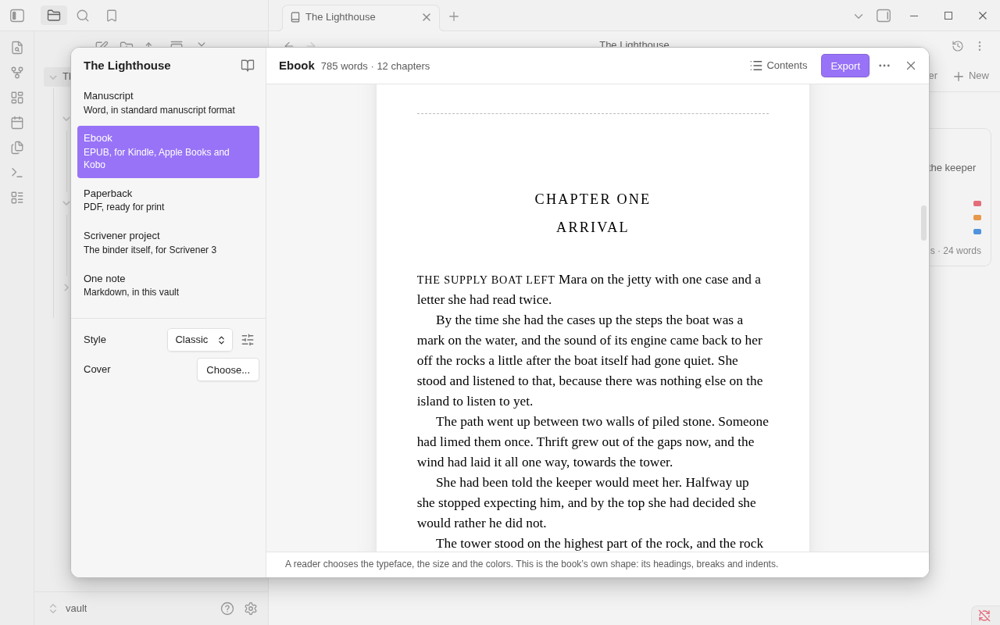

# Export

Export turns a binder into a file you can send or publish. It is what Scrivener calls Compile. Your writing stays
plain in Obsidian, and the look is given when the book is exported.

Export reads your notes and writes the exported file. Your notes aren't changed.

## What you can make

| Kind | What it is | Page |
|---|---|---|
| **Manuscript** | A Word file (.docx), or a PDF, in standard manuscript format, for agents and editors | [Manuscript](export-manuscript.md) |
| **Ebook** | An EPUB for Kindle, Apple Books and Kobo | [Ebook](export-ebook.md) |
| **Paperback** | A print-ready PDF: the book on a page of the size it will be printed at | [Paperback](export-paperback.md) |
| **Scrivener project** | The binder itself as a Scrivener 3 project (.scriv) | [Scrivener project](export-scrivener.md) |
| **One note** | The whole binder as a single Markdown note in your vault | [One note](export-one-note.md) |

A manuscript is set in a **manuscript style**; an ebook and a paperback in a **book style**. Change
one, or make your own, in the [style editor](export-styles.md).

A PDF is made on a computer. On a phone or tablet you can look at its pages and choose its style, and export it when
the vault is open on a computer.

## Opening the Export window

- In the binder view, open **More options** (the three dots) and choose **Export...**.
- In the file explorer, right-click a binder, or a folder in one, and choose **Export...**.
- On the corkboard or in the outliner, right-click a folder and choose **Export...**.
- From the command palette, run **Export binder**.

Export works on the binder, or on the folder you opened it from: export one part of a book by exporting its folder.

## Export again

Once a binder has been exported, **Export again** makes the same kind once more, in the same place, without opening
the window. It is in the binder view's **More options** menu and in the command palette.

- It uses the choices as they stand now: the binder's style, its Book details, what the window was last set to.
- It asks one thing, and only when it must: whether to replace a file that is no longer the one the last export
  left there.
- A binder that hasn't been exported on this device gets the window instead.
- On a phone or tablet the file goes to the `Exports` folder and then to the share sheet, as always.

## The window

The window has two sides.

**On the left**, what to make and its choices:

1. The five kinds. Click one. The window opens on the kind you made last.
2. The chosen kind's few choices, such as **Style**. Each kind's page lists them. The sliders button beside
   **Style** is **Edit this style**: see [Styles](export-styles.md).
3. Where the file will go, or where it went.
4. A list headed "3 things to look at" (or however many): what export will leave out or change. See
   [below](#things-to-look-at).

Beside the book's name is the **Book details** button, for a manuscript, an ebook or a paperback. See
[Book details and structure](book-details.md).

**On the right**, what is being made:

- Its name and size: "12,480 words · 9 chapters", or for a PDF "212 pages · 5 × 8 in".
- **Contents** lists the pages Binders makes, then every note and folder with the part it was given in the book:
  part, chapter, scene, front or back matter. Click a row to open its note. Click the part at the end of a row to
  change it: see [Export as](book-details.md#overruling-it). Click **Contents** again for the preview.
- **Export** makes the file. While a long book is being made the bar says what it is doing, with **Cancel** beside
  it.
- The **More** menu has **Choose where to save...**, **Show the Exports folder**, **Edit this style** and **Book
  details...**.
- The preview: the text as it will read. For a PDF it is the pages themselves, exactly as they will print.

Nothing has to be decided before the first file. Choose a kind and choose **Export**.

## Where the file goes

### On a computer

1. Export opens your system's save dialog. It starts in a folder named `Exports` beside the binder.
2. Choose where to save. This is the one place Binders writes outside your vault, and only where you say.
3. The window then says where the file was saved, with **Show in folder** and **Open**.

Under that is **Save here next time without asking**. Tick it and later exports of that kind, of that binder, go
straight to the same place.

- A file already there that export didn't write, or that has been changed since, is asked about before it is
  replaced.
- To be asked again, choose **Choose where to save...** in the window's **More** menu, untick the box, or choose
  **Ask again** under **Remembered places** in Binders' settings.
- **Show the Exports folder**, in the **More** menu, opens that folder in your file manager. The folder is made when
  a file is first saved there.
- A manuscript exported as a PDF to the place its Word file was saved goes beside the Word file, not over it.
- Remembered places are kept on the device, not in your vault, since a path on one computer means nothing on
  another.

### On a phone or tablet

The file goes into the `Exports` folder in your vault, and then to the share sheet, so you can send it to another
app. A Scrivener project is zipped first. A PDF isn't made there: see [Paperback](export-paperback.md#on-a-phone-or-tablet).

### The Exports folder

- **Exports folder** in Binders' settings renames it. A name, such as `Exports`, is a folder beside each binder. A
  path, such as `Books/Exports`, is one folder for the whole vault.
- Obsidian lists a .docx or an .epub in its file explorer only with **Detect all file extensions** turned on, under
  **Settings → Files and links**. The files are there either way.

**One note** is different: it makes a note in your vault, where you say. See [One note](export-one-note.md).

## Leaving a note out

Turn off **Include in export** on a note or a folder to leave it out of every kind of export. A folder that is left
out takes everything in it along.

You'll find **Include in export** in:

- a card's or row's right-click menu (on a tablet, **Leave out** under **Export as**: see [Phones and tablets](mobile.md));
- the outliner's **Export** column;
- the [inspector](inspector.md).

**Leave out**, under **Export as** in the same menus and on a row of **Contents** in the Export window, does the
same thing.

This is how a binder keeps research, character sheets or an outline beside its book.

## Things to look at

Under the choices the window lists each thing export will leave out or change, with the note it is in. Click one to
open its note (or, for a style's line, the style editor).

- a picture that isn't found, or isn't a PNG, JPEG or GIF;
- an embedded PDF or other file;
- part of a note embedded by its heading;
- math, and a tag in a line of text (both exported as you typed them);
- HTML (its text is kept);
- a folder deeper than the book's structure reaches;
- for an ebook, a cover smaller than stores ask for;
- for a paperback, a book whose language isn't written in letters the style's typeface has;
- a line of a [style's file](export-styles.md#a-styles-file) that can't be read.

What is listed is for you to decide about. The export goes ahead either way.

## What is remembered

How Export was last set up (the kind, the switches, a manuscript's file and paper) is kept in Binders' settings, for
the vault. A book's own details, its styles and a paperback's page size are kept in its binder note. See [Book details and structure](book-details.md).

## Limits

- A PDF is made on a computer only.
- Pictures in formats other than PNG, JPEG and GIF are not exported.
- Export doesn't change your notes, and an exported file isn't read back in. A Scrivener project is the one thing
  that comes back: see [Import from Scrivener](import-scrivener.md).

Next: [Book details and structure](book-details.md)
