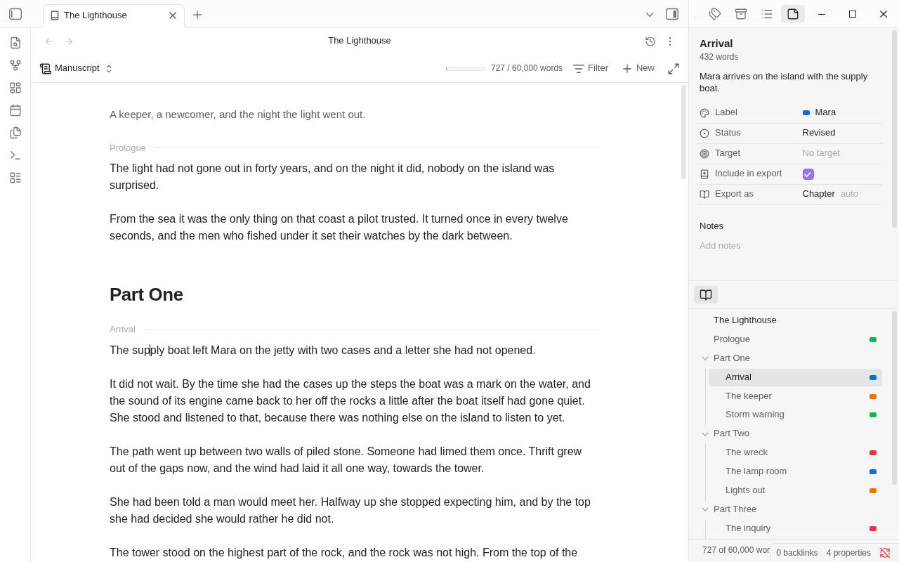

# The inspector and the contents

Two views for the sidebar, as Obsidian's Outline and Backlinks are. The **inspector** shows the details of the scene
you have in hand and lets you change them without leaving the page. The **contents** are the whole book as one list,
so you always know where you are.

Put them side by side, one over the other, in either sidebar, or close them.

## Where they are

Opening a binder puts both among the right sidebar's tabs, if they aren't there already. The sidebar isn't opened
for them, and the tab you had in front stays in front. Open the sidebar and they are there.

- They stay when you close the binder, as Outline stays with no note open.
- Close one and it comes back with the next binder you open.
- To keep them closed, turn off **Show the inspector and contents with a binder** in Binders' settings. Then you
  open them yourself.
- **Show inspector** and **Show contents** in the command palette open the sidebar on them, or make the tab if there
  is none. **Show contents** is in the binder view's **More options** menu too.

## The inspector

The inspector follows the tab you're writing in. It shows:

- in the manuscript, the section the cursor is in (once that has scrolled out of sight, the section at the top of
  the page);
- on the corkboard or in the outliner, the selected card or row;
- with nothing selected, the folder the view shows, or the binder itself;
- a note of a binder open in a tab of its own.

### What you can set

| Field | What it is |
|---|---|
| **Synopsis** | The same synopsis the note's card shows. Click it to type. Ctrl+Enter (Cmd+Enter on macOS) saves; Esc leaves it as it was |
| **Label** | The same menu a card has. See [Labels, statuses and targets](labels-statuses-targets.md) |
| **Status** | The same menu a card has |
| **Target** | The word count target. Click to type a number |
| **Story date** | When the scene happens in the story. Click to type it in words or as `1987-06-14`; nothing typed takes it away. Not shown for the binder itself. See [Story date](story-date.md) |
| **Include in export** | Untick to leave the note or folder out of every export |
| **Export as** | The part the note or folder plays in an exported book: **Part**, **Chapter**, **Scene**, **Front matter** or **Back matter**. Until you choose one it shows the part export gives it by its place, marked "auto". **Automatic** in the menu goes back to that. A folder can't be a scene. See [Book details and structure](book-details.md) |
| **Notes** | Your own notes on the scene. See [Scene notes](scene-notes.md) |
| **Snapshots** | A note's snapshots, newest first, with a camera to take one; for a folder, the folder's own, and with nothing selected the binder's. Click a row to open the Snapshots window on it. See [Snapshots](snapshots.md) |

### Several at once

With several cards or rows selected the inspector shows what they share, and "Mixed" where they differ. A label,
status, target, story date or **Export as** set there goes to all of them.

### What you type is kept

A field is saved to the note it was opened on as soon as you leave the field, the cursor moves to another section,
or you close the tab or the app. If it can't be saved, the text stays in its field and the inspector stays on that
note, so you can try again or copy it.

## The contents

The contents are the whole book as one list, in its order, with the row you're on marked and kept in sight as you
write.

| To | Do this |
|---|---|
| Go to a scene | Click its row. In the manuscript the page scrolls to that section; on the corkboard its folder opens and its card is selected; in the outliner its row is selected. With only a note open, the note opens |
| Open it in a new tab | Ctrl-click (Cmd-click on macOS) |
| Fold a folder | Click its arrow |
| Use the keyboard | The arrow keys, Home, End and Enter work as in the file explorer |

The contents don't reorder. Drag in the file explorer, on the corkboard or in the outliner for that.

With no binder open the contents say "No binder is open."

## On phones and tablets

The inspector and the contents are pages of the right drawer, put there when you open a binder. Swipe in from the
right edge, or run **Show inspector**. The inspector is on the section you last tapped. A tap on a row of the
contents closes the drawer on a phone and takes the manuscript there.

Next: [Labels, statuses and targets](labels-statuses-targets.md)
